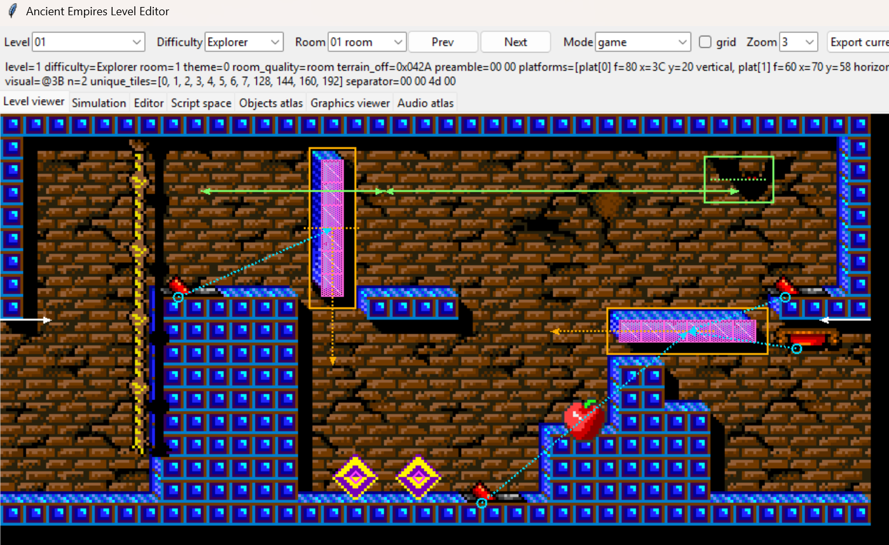
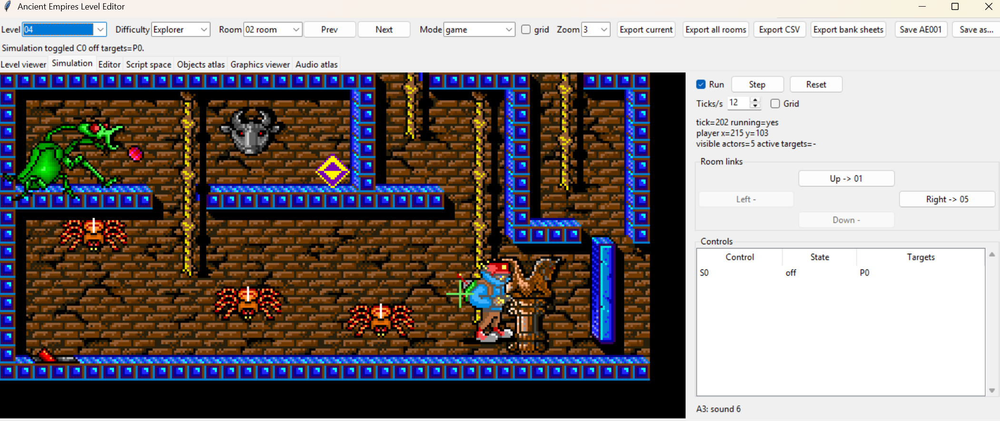
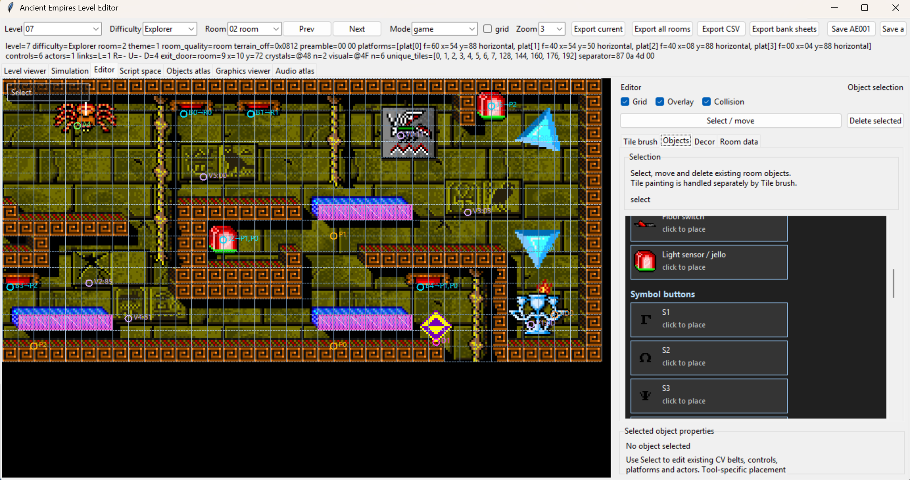
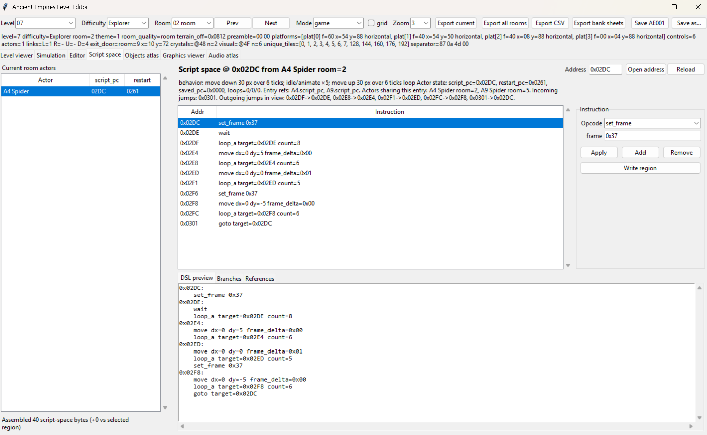

# Screenshot Tour

These screenshots are generated from the live Tk editor with local game assets.
Run `python tools/capture_docs_screenshots.py --exe AEPROG.EXE --dat AE000.DAT AE001.DAT`
to refresh them after visual UI changes.

## Level Viewer

The Level viewer is the safest place to inspect decoded rooms. It combines the
pixel-art room render with native Tk overlays for controls, actors, room exits,
runtime objects and relationship lines. Overlay presets make it quick to switch
between a clean room preview and a reverse-engineering/debug view.

## Simulation

Simulation runs a room-local model of actor scripts, controls, green blocks,
runtime `0x07` collision footprints and room links. It is meant for behavior
checks: click a control, emit a wall symbol, move the player start with right
click, then watch the same logical room react without editing the file.

## Editor

The Editor tab is the active write surface. It supports terrain painting,
brushes, known object placement, object selection, property editing and guarded
write-back for structures the parser understands. Unknown bytes stay visible
through debug tooling instead of being silently rewritten.

## Script Space

Script space decodes reachable actor bytecode into editable instruction rows,
branch references and a DSL preview. This keeps actor behavior research close to
the room that uses it and gives future edits a safer, structured surface.
